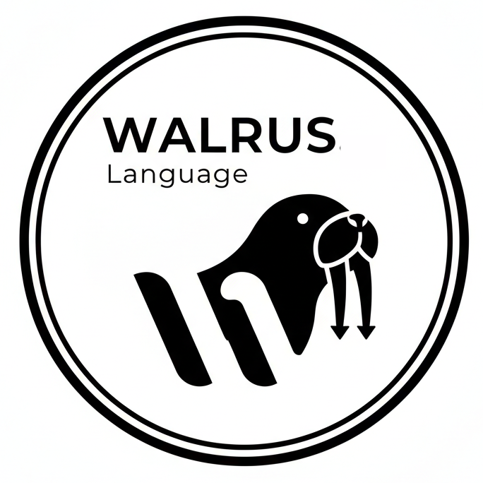

<div align="center">
    
    <h1>🦭 Walrus Programming Language</h1>
</div>

A fast, expressive programming language with a clean syntax and powerful features, built in Rust.

## Overview

Walrus is a dynamically-typed, interpreted programming language that combines simplicity with power. It features both a tree-walking interpreter and a **bytecode virtual machine** for efficient execution, along with a **mark-and-sweep garbage collector** and comprehensive support for modern programming paradigms.

## Key Features

### Dual Execution Modes

- **Bytecode VM**: High-performance stack-based virtual machine with call frames and tail call optimization
- **Tree-Walking Interpreter**: Direct AST interpretation for development and debugging
- **Disassembler**: Inspect generated bytecode and analyze program structure

### Language Features

- **First-Class Functions**: Functions as values with nested function support
- **Structs & Methods**: Object-oriented programming with struct definitions and static methods
- **Comprehensive Data Types**: integers, floats, strings, booleans, lists, tuples, dictionaries, ranges
- **Control Flow**: if/else conditionals, while loops, for loops with iterators, break/continue
- **Format Strings**: Embedded expressions within string literals (f-strings)
- **Short-Circuit Evaluation**: Optimized boolean logic with `and`/`or` operators
- **Recursion**: Full support for recursive functions with tail call optimization
- **String Manipulation**: Slicing, indexing, and string operations
- **Collection Operations**: List/dict concatenation, negative indexing, in-place modification

### Virtual Machine Architecture

- **Stack-Based Execution**: Efficient push/pop operations for expression evaluation
- **Call Frame Stack**: Proper function call semantics with frame pointers (not child VMs)
- **Shared Locals Vector**: Memory-efficient local variable storage across frames
- **Tail Call Optimization**: `TailCall` opcode reuses frames for recursive functions
- **80+ Opcodes**: Comprehensive instruction set including specialized zero-operand variants

### Compiler Optimizations

- **Constant Folding**: Arithmetic and boolean expressions evaluated at compile time
- **Specialized Opcodes**: `LoadConst0`, `LoadLocal0-3`, `LoadGlobal0-3` for common indices
- **Stack Operations**: `Dup`, `Swap`, `Pop2`, `Pop3` for efficient manipulation
- **Memory-Optimized**: u32 indices reduce instruction size from 16 to 12 bytes
- **Forward Declaration**: Two-pass compilation for mutual recursion support

### Memory Management

- **Mark-and-Sweep GC**: Automatic garbage collection with configurable thresholds
- **Arena Allocation**: Separate `DenseSlotMap` arenas for each heap type
- **Memory Tracking**: Byte-level allocation tracking triggers GC intelligently
- **String Interning**: Via `strena` for deduplicated string storage
- **Custom Allocator**: `mimalloc` for improved allocation performance

### Built-in Functions

| Function              | Description                         |
| --------------------- | ----------------------------------- |
| `len(x)`              | Get length of string, list, or dict |
| `str(x)`              | Convert value to string             |
| `type(x)`             | Get type name of a value            |
| `input(prompt)`       | Read user input with prompt         |
| `__gc__()`            | Manually trigger garbage collection |
| `__heap_stats__()`    | Get heap statistics as a dict       |
| `__gc_threshold__(n)` | Configure GC allocation threshold   |

### Developer Experience

- **REPL Mode**: Interactive shell for rapid prototyping
- **Debugger Support**: Breakpoints, step-through execution, and stack inspection
- **Stack Traces**: Human-readable call stack on errors (truncated for deep recursion)
- **Comprehensive Error Messages**: Detailed error reporting with source locations
- **Benchmark Suite**: 20+ benchmarks comparing against Python

## Installation

### Prerequisites

- [Rust](https://www.rust-lang.org/tools/install) (latest stable version)

### Build from Source

```bash
git clone https://github.com/sb2bg/walrus.git
cd walrus
cargo build --release
```

### Run

```bash
# Execute a file
cargo run -- file.walrus

# Start REPL
cargo run

# Compile mode (VM execution)
cargo run -- -c file.walrus

# Disassemble bytecode
cargo run -- -d file.walrus

# View help
cargo run -- --help
```

## Quick Start

### Hello World

```walrus
println("Hello, World!");
```

### Comments

Walrus supports both single-line and multi-line comments:

```walrus
// This is a single-line comment

/* This is a multi-line comment
     that can span multiple lines */

let x = 42; // Comments can appear after code

/* Multi-line comments can also be inline */ let y = 84;
```

### Variables & Types

```walrus
let number = 42;
let pi = 3.14159;
let name = "Walrus";
let active = true;
let items = [1, 2, 3, 4, 5];
let data = {"key": "value", "count": 10};
```

### Format Strings

```walrus
let name = "Alice";
let age = 30;
let score = 95.5;

// Basic interpolation
println(f"Hello, {name}!");

// Multiple expressions
println(f"User: {name}, Age: {age}");

// Arithmetic expressions
println(f"Next year you'll be {age + 1}");

// Complex expressions
let items = [1, 2, 3];
println(f"List has {len(items)} items: {items}");
println(f"Score: {score * 100 / 100}%");
```

### Functions

```walrus
fn factorial : n {
        if n <= 1 {
                return 1;
        }
        return n * factorial(n - 1);
}

let result = factorial(5);  // 120
```

### Anonymous Functions

```walrus
let square = : x {
        return x * x;
};

let result = square(7);  // 49
```

### Structs

```walrus
struct Point {
        fn new : x, y {
                return {"x": x, "y": y};
        }

        fn distance : p1, p2 {
                let dx = p1["x"] - p2["x"];
                let dy = p1["y"] - p2["y"];
                return (dx * dx + dy * dy) ** 0.5;
        }
}

let p1 = Point.new(3, 4);
let p2 = Point.new(0, 0);
let dist = Point.distance(p1, p2);  // 5.0
```

### Control Flow

```walrus
// Conditionals
if score >= 90 {
        println("A");
} else if score >= 80 {
        println("B");
} else {
        println("C");
}

// While loop
let i = 0;
while i < 5 {
        println(i);
        i = i + 1;
}

// For loop with range
for x in 0..10 {
        println(x);
}

// For loop with list
for item in [1, 2, 3, 4, 5] {
        println(item);
}
```

### FizzBuzz Example

```walrus
for n in 1..101 {
        let result = "";

        if n % 3 == 0 {
                result += "Fizz";
        }

        if n % 5 == 0 {
                result += "Buzz";
        }

        if result == "" {
                result = n;
        }

        println(result);
}
```

### Quicksort Example

```walrus
fn quicksort : arr {
        if len(arr) <= 1 {
                return arr;
        }

        let pivot = arr[0];
        let less = [];
        let equal = [];
        let greater = [];

        for x in arr {
                if x < pivot {
                        less = less + [x];
                } else if x == pivot {
                        equal = equal + [x];
                } else {
                        greater = greater + [x];
                }
        }

        return quicksort(less) + equal + quicksort(greater);
}

let sorted = quicksort([64, 34, 25, 12, 22, 11, 90, 88]);
```

## 🏗️ Architecture

### Virtual Machine

The Walrus VM is a stack-based bytecode interpreter with proper call frames:

- **80+ Opcodes**: Comprehensive instruction set for all language features
- **Call Frame Stack**: Each function call pushes a frame with return address, frame pointer, and bytecode reference
- **Shared Locals Vector**: All frames share a single locals vector, indexed by frame pointer + local index
- **Global Variables**: Stored in `Rc<RefCell<Vec<Value>>>` for cross-frame persistence
- **Tail Call Optimization**: Recursive tail calls reuse the current frame instead of pushing new ones
- **Automatic GC**: Collection triggered by allocation count or memory threshold

### Bytecode Compiler

- **Two-Pass Compilation**: Forward declarations for mutual recursion support
- **Constant Folding**: Evaluates `1 + 2 * 3` at compile time
- **Jump Patching**: Forward references resolved after compilation
- **Loop Context Tracking**: Break/continue with proper local cleanup
- **Scope Management**: Depth tracking distinguishes local vs. global variables
- **Symbol Tables**: Separate tracking for locals and globals with indices

### Garbage Collector

The mark-and-sweep GC traces from roots and frees unreachable objects:

- **Root Collection**: Stack, locals, globals, and constants are all roots
- **Configurable Thresholds**: Default 1024 allocations or 8MB estimated memory
- **Memory Estimation**: Tracks approximate bytes for lists, dicts, functions, etc.
- **Statistics Tracking**: Total bytes freed, collection count available via `__heap_stats__()`
- **Manual Trigger**: `__gc__()` builtin for explicit collection

### Memory Management

- **Arena-Based Heap**: Separate `DenseSlotMap` arenas for lists, tuples, dicts, functions, iterators, structs
- **String Interning**: All strings stored once via `strena::Interner`
- **Generation-Indexed Keys**: Type-safe references prevent use-after-free
- **Copy-on-Write Semantics**: Values are small (key-based), heap data shared until modified

## 🔧 Development

### Running Tests

```bash
# Run test suite
./scripts/run-tests.sh

# Run benchmarks (Python vs Walrus comparison)
cd benchmarks && ./run_benchmarks.sh
```

### Building Optimized

```bash
# Release build
./scripts/build-optimized.sh

# Platform-specific
./scripts/build-linux-optimized.sh
./scripts/build-windows-optimized.sh
```

### Profiling

```bash
# Memory profiling with dhat
./scripts/dhat.sh

# CPU profiling (macOS)
./scripts/instruments.sh
```

## 📄 Examples

Check out the `showcase.walrus` file for a comprehensive demonstration of all language features, including:

- Bank account system
- Game character battles
- Prime number generation
- Text processing and palindromes
- Mathematical sequences
- Higher-order functions

Run it with:

```bash
cargo run -- showcase.walrus
```

## 🤝 Contributing

Contributions are welcome! Areas of interest:

- Standard library expansion
- Performance optimizations
- Additional language features
- Documentation improvements

Please check our [issue tracker](https://github.com/sb2bg/walrus/issues) for open tasks.

## 📜 License

Walrus is licensed under the MIT License. See [LICENSE](LICENSE) for details.

## 🙏 Acknowledgments

Built with:

- [LALRPOP](https://github.com/lalrpop/lalrpop) - Parser generator
- [SlotMap](https://github.com/orlp/slotmap) - Arena-based memory management
- [mimalloc](https://github.com/microsoft/mimalloc) - High-performance allocator
- [rustc-hash](https://github.com/rust-lang/rustc-hash) - Fast hashing (FxHashMap/FxHashSet)
- [strena](https://github.com/Kixiron/strena) - String interning
- [float-ord](https://github.com/notriddle/rust-float-ord) - Orderable floats for hash maps

---

**Happy Coding with Walrus! 🦭**
